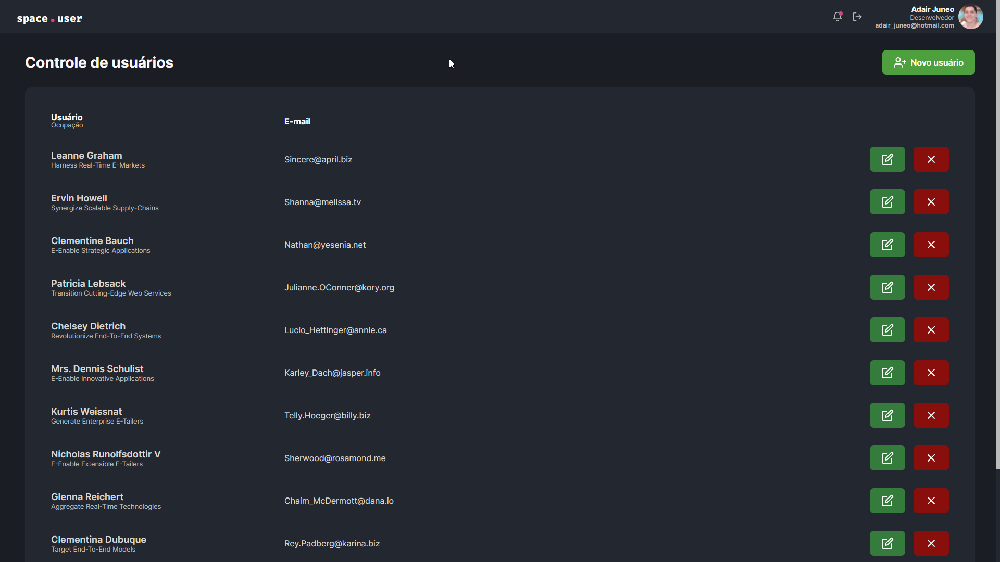

# Teste Prático - Linear Sistemas

<h1 align="center">
    
</h1>

## 💻 Projeto

Vídeo demontração de funcionalidades e app completo clicando aqui [Acessar vídeo](https://drive.google.com/file/d/1hUcqGT4UdEJoPngmGjoZGiZixH8tsDwJ/view?usp=sharing)

Conforme proposto no desafio e as instruções passadas, a obrigação era o desenvolvimento de um App simples para "controle de usuário" com as funcionalidades de **Inserção**, **Remoção** e **Detalhamento** de usuários. O layout(conforme instruído) deveria ser desenvolvido por mim sem qualquer design systems para seguir e utilizando a tecnologia **[React](https://reactjs.org/docs/getting-started.html)**. Para hidratação dos dados no App deixaram a disposição uma API com todas as Requisições(GET, POST e DELETE) disponíveis e para consumir essa API o meu dever era utilizar a biblioteca **[AXIOS](https://axios-http.com/docs/intro)**. Por fim deixaram de forma opcional o uso de **[REDUX](https://redux.js.org/)** na aplicação.

## ⚛️ Como foi o desenvolvimento

O layout do app foi algo bem tranquilo, resolvi desenvolver algo "mais completo" e que realmente faça referência ao objetivo proposto. Como estamos utilizando **React**, resolvi criar vários componentes estilizando com uso do SASS cada um deles individulamente, o que faz jus ao uso do **React**, o resultado final do layout e do App completo estão disponíveis ao clicar na imagem bem acima. Sobre a hidratação dos dados no App, resolvi utilizar uma biblioteca que cada dia mais cresce no ambiente de desenvolvimento React, a **React Query**. O por quê do uso de **React Query** no app é justificavél por conta da flexibilidade que essa biblioteza entrega quando assunto é "boa experiência do usuário", por quê é necessário que tenhamos respostas rápidas as ações e atualizações em tempo real dos dados que estão sendo geridos, o **React Query** faz isso e faz **muito bem**. Outro ponto muito positivo de utilizar o **React Query** é a facilidade de escalabilidade para implementação de novas funções nesse cenário de controle de usuários. Poderiamos utilizar sim **REDUX** como foi proposto, com um estado global e várias ACTIONS para inserção, remoção e detalhamento. Outra descisão que tomei foi quanto a "tela/componente" de consulta e inserção de novos usuários, optei por ao invés de criar uma rota para cada situação e redirecionar o usuário, visando também uma boa experiência e usabilidade, resolvi criar "modais", onde na mesma tela em que o usuário está, ele ao executar essas ações um componente menor do que a tela abre sobrepondo a tela principal e para gerir esses componentes utilizei a **CONTEXT API** do próprio **React**. Por fim, o resultado final do desafio ficou bem legal, serviu muito como ainda mais aprendizado para domínio do React e suas bibliotecas. Outro ponto muito importante, além do uso de boas práticas do **JavaScript**, utilizei o **TypeScript**, que hoje em dia ajuda **MUITO** o desenvolvedor, ainda mais no ambiente de desenvolvimento **React**.

## 🧪 Tecnologias

Esse projeto foi desenvolvido com as seguintes tecnologias:

- [React](https://reactjs.org/docs/getting-started.html)

## 📚 Bibliotecas

Para auxiliar no desenvolvimento do projeto, utilizei as seguinte bibliotecas:

- [SASS](https://sass-lang.com/)
- [AXIOS](https://axios-http.com/docs/intro)
- [TypeScript](https://www.typescriptlang.org/docs/)
- [**React Query**](https://react-query.tanstack.com/overview)
- [React Modal](https://reactcommunity.org/react-modal/)
- [ReactHotToast](https://react-hot-toast.com/docs)

## 🚀 Como executar

Clone o projeto e acesse a pasta, a seguir temos os passos:

```bash
$ git clone https://github.com/adairjuneoaf/test-pratico-front
$ cd test-pratico-front
```

Para iniciá-lo, siga os passos abaixo:

```bash
# Instalar as dependências
$ yarn
# Iniciar o projeto
$ yarn dev
```

Para realizar alguns testes no projeto, resolvi criar um servidor local utilizando **[JSON Server](https://www.npmjs.com/package/json-server)**, portanto, caso tenha interesse, basta executar o comandos abaixo.

```bash
# Iniciar o servidor
$ yarn server
```

** Lembrando que para segurança do projeto, ao dispoinibilizar em produção, foi criada uma váriavel global no arquivo `.env.local`, que deve ser criado por você quando clonar o projeto. Dentro desse arquivo, é necessário criar uma váriavel chamada `REACT_APP_API_BASE_URL` e informar a URL da API. Caso esteja utilizando o **JSON Server\*\*, basta informar a essa variável o seguinte endereço: `http://localhost:3001`.

O app estará disponível no seu navegador de internet pelo endereço http://localhost:3000.

Você pode acessar o projeto em produção clicando neste link [Acessar projeto](https://test-front-end-react-adairjuneo.vercel.app/). Como a API disponibilizada persiste os dados, no ambiente de produção não é possível visualizar o app em funcionamento completo, portanto clone o projeto e faça os testes na sua máquina local.
